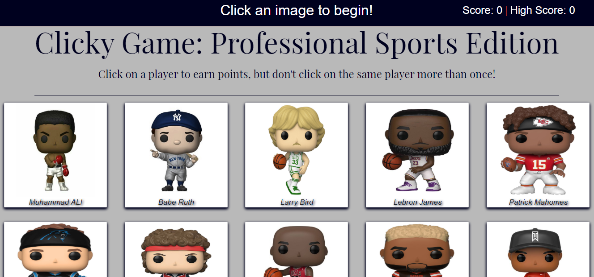

# React-Memory-Game

<h1>Overview</h1>

Clicky Game: Professional Sports Edition is a memory game built with React. On clicking an image, the game begins. Your score increases if you click any image that has not be clicked before. As soon as you click an image for the second time, your score resets and the game starts over. Almost forgot, each click the players are shuffled around making the game a bit harder.
 

# Demo (via GitHub Pages)
https://zsievers.github.io/React-Memory-Game/

# Technologies Used
 
<li>React</>
<li>Javascript</li>
<li>Bootstrap</li>

# Future Development

<li>Animations</li>
<li>Styling</li>
<li>Footer</li>
<li>Added difficulty</li>

